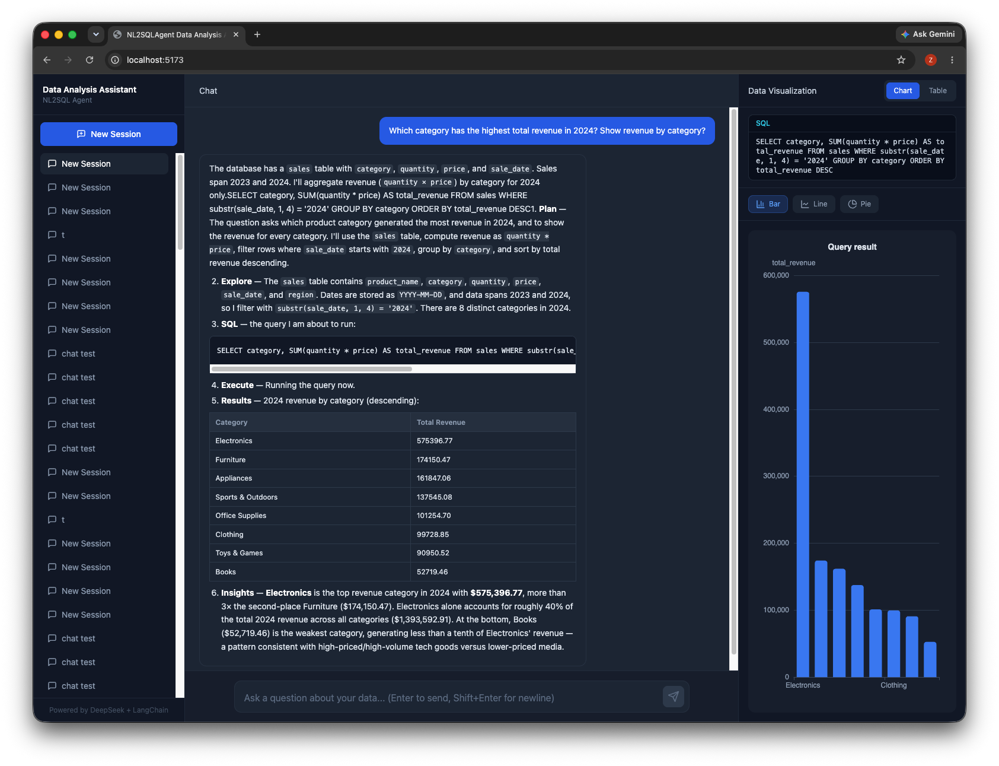

# NL2SQLAgent

An intelligent data-analysis assistant that turns natural-language questions
into SQL, runs them against a SQLite database with a read-only LangChain agent,
and streams the answer, the executed SQL, and auto-generated charts to a React
frontend in real time.



## Features

- **Natural language to SQL** - Qwen3 model drives a LangChain SQL agent
  (`SQLDatabaseToolkit` + `create_agent`) that inspects the schema, generates a
  query, double-checks it, executes it, and explains the results.
- **Read-only by default** - the system prompt forbids writes and a defense-
  in-depth guard rejects `INSERT` / `UPDATE` / `DELETE` / `DROP` / `ALTER` /
  `CREATE` before execution.
- **Provider-pluggable LLM** - works with any OpenAI-compatible endpoint
  (OpenCode Go, OpenRouter, DeepSeek, ...) or the legacy Alibaba Bailian
  `ChatTongyi` integration - configured through `.env`.
- **Session management & context memory** - sessions persist in SQLite with a
  sliding-window memory of the last 10 rounds per conversation.
- **Real-time streaming** - the chat endpoint streams
  `thinking / text / sql / data / chart / done` events over SSE; the frontend
  renders text incrementally, shows the SQL, and updates the chart live.
- **Auto chart heuristics** - `GROUP BY` with ≤ 6 groups suggests a pie chart,
  otherwise a bar chart; the panel also supports line charts and a table view.
- **Dark three-pane UI** - session sidebar, Q&A area, and visualization panel
  built with React + Tailwind CSS + Zustand + ECharts.

## Tech stack

| Layer | Technology |
| --- | --- |
| Backend | FastAPI, LangChain, SQLite (SQLAlchemy), sse-starlette |
| LLM | DeepSeek (`deepseek-v4-flash`, cost-efficient) via OpenCode Go / OpenAI-compatible API |
| Frontend | React 18, Vite, TypeScript, Tailwind CSS, Zustand, ECharts |
| Tests | pytest (backend), Vitest + Testing Library (frontend) |

## Getting started

### Prerequisites

- Python 3.11+ and Node.js 18+
- An API key for an OpenAI-compatible LLM provider (e.g. an
  [OpenCode](https://opencode.ai) subscription)

### 1. Backend

```bash
cd backend
python3 -m venv .venv
source .venv/bin/activate
pip install -r requirements.txt
cp .env.example .env
```

Edit `backend/.env` and set your LLM credentials:

```env
LLM_PROVIDER=openai_compatible
LLM_API_KEY=your_api_key
LLM_BASE_URL=https://opencode.ai/zen/go/v1
LLM_MODEL=deepseek-v4-flash
```

Start the API server:

```bash
uvicorn app.main:app --reload --port 8000
```

- Health check: <http://localhost:8000/health>
- Interactive API docs: <http://localhost:8000/docs>

### 2. Frontend

```bash
cd frontend
npm install
npm run dev
```

Open <http://localhost:5173>. The first start seeds the sample SQLite database
(`sales` and `employees` tables) automatically.

## Usage

1. Create a session in the left sidebar.
2. Ask a question in natural language, e.g. *"What are the top 5 products by
   total quantity sold?"*
3. Watch the answer stream in, expand **View SQL** to inspect the generated
   query, and switch between chart types or the table view on the right.
4. Switch sessions to see independent conversation history.

## Testing

```bash
# Backend unit/integration tests (no API key required)
cd backend && ./.venv/bin/python -m pytest

# Frontend tests and production build
cd frontend && npm test && npm run build
```

End-to-end verification with a real key (requires `LLM_API_KEY` in
`backend/.env`):

```bash
cd backend
./.venv/bin/python scripts/test_qwen3.py   # connectivity + tool calls
./.venv/bin/python scripts/test_nl2sql.py  # NL2SQL agent correctness
./.venv/bin/python scripts/test_e2e.py     # full /api/chat pipeline
```

## LLM provider configuration

The LLM layer is provider-agnostic. `app/core/llm.py` reads:

- `LLM_PROVIDER` - `openai_compatible` (default) or `tongyi` (legacy Bailian)
- `LLM_API_KEY` - your provider key (also accepts `OPENCODE_CODEX_API_KEY`
  and the legacy `DASHSCOPE_API_KEY` as fallbacks)
- `LLM_BASE_URL` - OpenAI-compatible base URL
- `LLM_MODEL` - model name (defaults to the cost-efficient
  `deepseek-v4-flash`; OpenCode Go also exposes `qwen3.7-max`, `qwen3.8-max`,
  `deepseek-v4-pro`, etc.)

Switching providers is a `.env` change only - no application code changes.

## Project structure

```text
backend/
├── app/
│   ├── api/           # session CRUD, database introspection, /api/chat SSE
│   ├── core/          # llm factory, SQL agent, memory, chart heuristics
│   ├── db/            # SQLite connection + session/message persistence
│   └── schemas/       # Pydantic response models
├── scripts/           # real-key verification scripts (test_qwen3 / nl2sql / e2e)
├── tests/             # pytest suite
└── requirements.txt
frontend/
├── src/
│   ├── components/    # ChatSidebar, ChatArea, ChartPanel
│   ├── hooks/         # useSession, useChat (SSE)
│   ├── services/      # REST + SSE API client
│   ├── store/         # Zustand state
│   └── types/         # shared TypeScript contracts
└── package.json
```

## Status

MVP complete: all four phases (foundation, frontend UI, backend APIs,
frontend-backend integration) are implemented, tested, and verified
end-to-end with a real LLM key.

## License

MIT - change to your preferred license before publishing.
