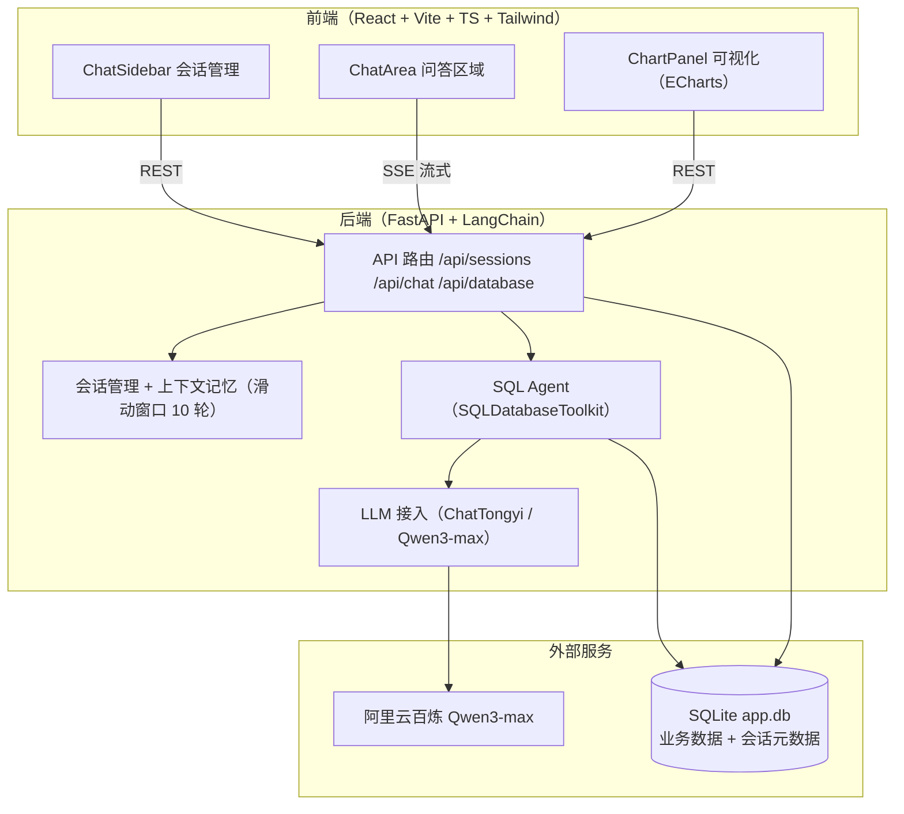

<div align="center">
  <a href="phased_plan_en.md">English</a> · <strong>中文</strong>
</div>

# NL2SQLAgent 分阶段实施计划

## 概述

保持已确认的总体设计不变（FastAPI + LangChain SQLDatabaseToolkit Agent + 百炼 Qwen3-max/ChatTongyi、只读 SQL、单 SQLite `app.db`、SSE 流式、React + Tailwind + Zustand + ECharts 三栏布局），按用户指定的四个阶段推进：基础框架与测试 → 前端 UI → 后端接口 → 前后端联调。每阶段含明确交付物与验收标准。

### 系统设计图



### 核心依赖

**后端 `backend/requirements.txt`**

```
fastapi>=0.109.0
uvicorn[standard]>=0.27.0
pydantic>=2.0.0
pydantic-settings>=2.0.0
python-dotenv>=1.0.0
langchain>=0.1.0
langchain-community>=0.0.20
dashscope>=1.14.0
sqlalchemy>=2.0.0
sse-starlette>=1.6.0
httpx>=0.25.0
```

**前端 `frontend/package.json` 核心依赖**

```json
{
  "react": "^18.2.0",
  "react-dom": "^18.2.0",
  "zustand": "^4.5.0",
  "echarts": "^5.5.0",
  "echarts-for-react": "^3.0.2",
  "react-markdown": "^9.0.1",
  "lucide-react": "^0.312.0"
}
```

> 版本号均为最低版本约束，安装时会解析为当前最新的兼容版本。

## Phase 1：搭建前后端基础框架并运行测试

- 仓库重构：新建 `backend/`（FastAPI 应用 + `requirements.txt` + `.env.example`）与 `frontend/`（Vite + React + TS + Tailwind 脚手架），移除根级 `pyproject.toml` 与 `src/` 占位包。
- 后端骨架：`main.py`（lifespan、CORS、`/health`）、`config.py`（`.env` 配置）、`db` 模块（初始化 `app.db`：`sales`/`employees` 中文种子数据 + `chat_sessions`/`chat_messages` 元数据表）。
- 前端骨架：三栏占位布局（ChatSidebar / ChatArea / ChartPanel 空壳）、vite/tsconfig/tailwind 配置、暗色主题样式。
- 测试：后端 pytest 冒烟测试（`/health`、DB 建表与种子数据、会话存储建表）；前端 `npm run build` 通过。
- 验收：`uvicorn app.main:app --reload --port 8000` 启动后 `/health` 返回 ok；pytest 全绿；前端构建成功。
- 验证标准：
  - 后端：`http://localhost:8000/health` 返回 200 ok
  - 后端：pytest 冒烟测试全部通过
  - 前端：`http://localhost:5173` 正常显示三栏占位 UI
  - 前端：`npm run build` 构建成功
  - CORS：前端页面跨域请求 `/health` 无报错

## Phase 2：研发前端 UI

- ChatSidebar：会话列表 / 新建 / 删除 / 重命名，首条提问自动生成标题。
- ChatArea：消息列表（markdown 渲染）、SSE 流式文本、SQL 代码块展示、停止生成、输入框。
- ChartPanel：图表 / 表格视图切换、柱状 / 折线 / 饼图切换、SQL 展示、后端连接状态指示。
- 状态与通信：zustand store（会话/消息/图表/视图模式）、`api.ts`（REST + fetch + ReadableStream 的 SSE 客户端）、`useSession` / `useChat` hooks。
- 测试：SSE 事件解析、store 逻辑（会话/消息/图表状态）、关键组件交互（Vitest + Testing Library）；后端未就绪时使用 `/chat/test` 端点或本地 mock 验证流式展示。
- 验收：`npm run dev` 可渲染完整三栏 UI；单测通过。
- 目录结构与组件清单：
  ```
  frontend/
  ├── index.html
  ├── package.json
  ├── vite.config.ts
  ├── tsconfig.json
  ├── tailwind.config.js
  ├── postcss.config.js
  └── src/
      ├── main.tsx                 # React 入口
      ├── App.tsx                  # 三栏布局 + 后端状态指示
      ├── index.css                # Tailwind 样式
      ├── types/index.ts           # Session / Message / ChartConfig / SSE 类型
      ├── services/api.ts          # REST + SSE（fetch + ReadableStream）客户端
      ├── store/useAppStore.ts     # Zustand 全局状态
      ├── hooks/
      │   ├── useSession.ts        # 会话加载/创建/删除/切换
      │   └── useChat.ts           # 发送消息 + SSE 流式处理
      └── components/
          ├── ChatSidebar/
          │   ├── index.tsx        # 会话管理面板
          │   └── SessionItem.tsx  # 会话列表项
          ├── ChatArea/
          │   ├── index.tsx        # 聊天区域容器
          │   ├── MessageList.tsx  # 消息列表
          │   ├── MessageItem.tsx  # 单条消息（Markdown 渲染）
          │   └── ChatInput.tsx    # 输入框
          └── ChartPanel/
              ├── index.tsx        # 图表面板容器（图表/表格切换）
              ├── Chart.tsx        # ECharts 图表
              └── DataTable.tsx    # 数据表格
  ```
- Zustand 状态：
  ```ts
  interface AppState {
    sessions: Session[]
    currentSessionId: string | null
    messages: Message[]
    isStreaming: boolean
    chartConfig: ChartConfig | null
    tableData: TableData | null
    viewMode: 'chart' | 'table'
  }
  ```
  对应操作方法：`createSession` / `selectSession` / `deleteSession` / `addMessage` / `updateLastMessage` / `setChartConfig` / `setTableData` / `setViewMode` 等。

## Phase 3：实际研发后端接口

- LLM 模块：`ChatTongyi` 接 `qwen3-max`，API Key 校验（缺失时报错），提供流式/非流式实例。
- 记忆模块：按会话 ID 加载最近 10 轮（20 条消息）历史并转换为 LangChain 消息，带内存缓存。
- Agent 模块：`SQLDatabaseToolkit`（list_tables / schema / query_checker / query）agentic 循环；系统提示词强制只读（禁止 INSERT/UPDATE/DELETE/DROP）；工具结果用 `ast.literal_eval` 解析（不用 `eval`）；图表启发式（GROUP BY 且 ≤6 行→饼图，否则柱状；ORDER BY + LIMIT→柱状；默认柱状）。
- API：`/api/sessions` CRUD 与消息查询、`/api/chat` SSE（thinking / text / sql / data / chart / error / done）、`/api/database/schema | tables | tables/{name}`。
- 测试：会话 CRUD 与持久化、记忆窗口裁剪、SSE 事件序列（mock LLM 返回固定 SQL，验证 thinking→sql→data→chart→done）、非法 SQL / 空结果 / 工具错误路径、只读约束验证。
- 验收：mock LLM 下 `/api/chat` 全流程通过；pytest 全绿。
- 目录结构：
  ```
  backend/
  ├── requirements.txt
  ├── .env.example            # DASHSCOPE_API_KEY / 模型名 / CORS
  ├── data/app.db             # 运行时生成：sales + employees + chat_sessions + chat_messages
  ├── tests/                  # test_*.py（pytest）
  └── app/
      ├── main.py             # FastAPI 入口：lifespan / CORS / 路由注册 / /health
      ├── config.py           # 配置管理（pydantic-settings）
      ├── api/
      │   ├── session.py      # /api/sessions CRUD 与消息查询
      │   ├── chat.py         # /api/chat SSE 流式
      │   └── database.py     # /api/database/schema|tables
      ├── core/
      │   ├── llm.py          # ChatTongyi(qwen3-max) 实例与系统提示词
      │   ├── memory.py       # 滑动窗口记忆（10 轮）
      │   └── agent.py        # SQL Agent 循环 + 图表启发式
      ├── db/
      │   ├── connection.py   # SQLite 初始化与种子数据
      │   └── session_store.py# chat_sessions / chat_messages 持久化
      └── schemas/
          ├── chat.py         # SSE 事件 / ChartConfig / QueryResult
          └── session.py      # Session 请求/响应模型
  ```
- API 接口：
  - `GET /health` — 健康检查
  - `GET /api/sessions` — 会话列表
  - `POST /api/sessions` — 创建会话
  - `GET /api/sessions/{id}` — 会话详情（含消息）
  - `PUT /api/sessions/{id}` — 更新会话标题
  - `DELETE /api/sessions/{id}` — 删除会话
  - `GET /api/sessions/{id}/messages` — 消息列表
  - `POST /api/chat` — 聊天（SSE 流式）
  - `GET /api/database/schema` — 数据库结构
  - `GET /api/database/tables` — 表列表
- SSE 事件类型：
  - `thinking` — AI 思考过程（工具调用）
  - `text` — 文本内容
  - `sql` — SQL 语句
  - `data` — 查询结果（columns / rows / raw）
  - `chart` — 图表配置
  - `error` — 错误信息
  - `done` — 完成标记
- LLM 配置：
  - 供应商：默认 `openai_compatible`（OpenCode Go 订阅，OpenAI 兼容端点），经 `ChatOpenAI`（langchain-openai）接入；`tongyi`（ChatTongyi / langchain-community）作为旧方案保留
  - 模型：默认 `deepseek-v4-flash`（OpenCode Go 端点实测可用，工具调用链路正常且成本更低；`qwen3.7-max` 亦实测可用，需要更强推理时可切换）
  - 鉴权：`LLM_API_KEY` 写入 `backend/.env`（兼容 `OPENCODE_CODEX_API_KEY` / `DASHSCOPE_API_KEY`），缺失时调用报错
  - 端点：`LLM_BASE_URL=https://opencode.ai/zen/go/v1`
  - 参数：`temperature=0.7`；Agent 工具调用使用非流式调用获取完整 `tool_calls`
  - 系统提示词：`SQL_AGENT_SYSTEM_PROMPT` 强制只读（禁止 INSERT/UPDATE/DELETE/DROP），查询结果限制 top 10
  - 记忆：滑动窗口 10 轮（20 条消息），从 `chat_messages` 重建并缓存
- 已验证接口契约（2026-08-14，OpenCode Go 真实调用验证）：
  - 非流式返回（AIMessage）：`content`（str）；`tool_calls`（list，每项 `id` / `name` / `args` / `type`，实测如 `{id: "call_...", name: "TopProducts", args: {"n": 3}}`）；`response_metadata`（`model_name` / `finish_reason`（`stop` 或 `tool_calls`）/ `id` / `token_usage{completion_tokens, prompt_tokens, total_tokens, completion_tokens_details.reasoning_tokens}`）。
  - 流式返回（AIMessageChunk）：`content` 为文本增量；OpenCode Go 对 qwen3.7-max 实测一次返回完整内容（1 个 chunk）；最终 chunk 的 `response_metadata` 携带 `finish_reason` 与 `token_usage`。
  - 工具调用回环：`llm.bind_tools([...])` → 首次 `AIMessage.tool_calls[0]`；把该 AIMessage 原样放回消息列表并追加 `ToolMessage(content=工具结果, tool_call_id=该 id)`，再次 invoke 得到最终答案；触发工具时 `finish_reason="tool_calls"`。
  - NL2SQL 链路（实测通过）：`SQLDatabase.from_uri()` → `SQLDatabaseToolkit(db, llm)` → `get_tools()`（sql_db_list_tables / sql_db_schema / sql_db_query / sql_db_query_checker）→ `create_agent(model, tools, system_prompt)` → `agent.stream_events({"messages":[...]}, version="v3")`；`tool_calls` 事件项字段为 `tool_name` / `input` / `output_deltas` / `output`。实测"top 5 products by total quantity sold"完整走 4 步并生成正确 SQL 与答案。
  - 验证脚本：`backend/scripts/test_qwen3.py`（连通性 / 流式 / 工具调用）、`backend/scripts/test_nl2sql.py`（NL2SQL 正确性）；真实 Key 仅存于 `backend/.env`（gitignore），脚本输出自动脱敏。

## Phase 4：前后端联调

- 配置 CORS 与前端 API 地址一致（localhost:5173 ↔ localhost:8000）；使用真实 `LLM_API_KEY` 执行 `test_qwen3`（连通性）、`test_nl2sql`（NL2SQL 正确性）、`test_e2e`（完整链路）。
- 验收场景：① 提问"按月统计销售额"→ 右侧渲染图表并可切换图表类型/表格视图；② 写操作被提示词拒绝并给出解释；③ 切换会话后历史与上下文记忆相互独立；④ 模型或后端不可用时前端显示友好错误。
- 交付：提交并推送代码，更新 README 的快速启动说明（后端 `.env` 配置、前端启动步骤）。
- 前端 API 服务层：
  ```ts
  // frontend/src/services/api.ts
  export const api = {
    getSessions: () => fetch('/api/sessions').then(r => r.json()),
    createSession: (title?: string) =>
      fetch('/api/sessions', {
        method: 'POST',
        headers: { 'Content-Type': 'application/json' },
        body: JSON.stringify({ title }),
      }).then(r => r.json()),
    deleteSession: (id: string) =>
      fetch(`/api/sessions/${id}`, { method: 'DELETE' }),
    getMessages: (id: string) =>
      fetch(`/api/sessions/${id}/messages`).then(r => r.json()),
  }
  ```
- SSE 客户端（`/api/chat` 为 POST + JSON，使用 fetch + ReadableStream 解析，而非 EventSource）：
  ```ts
  // frontend/src/hooks/useChat.ts（简化示意）
  const sendMessage = async (sessionId: string, message: string) => {
    const res = await fetch('/api/chat', {
      method: 'POST',
      headers: { 'Content-Type': 'application/json', Accept: 'text/event-stream' },
      body: JSON.stringify({ session_id: sessionId, message }),
    })
    const reader = res.body!.getReader()
    const decoder = new TextDecoder()
    let buffer = ''
    while (true) {
      const { done, value } = await reader.read()
      if (done) break
      buffer += decoder.decode(value, { stream: true })
      // 按 SSE 帧解析：event: text/sql/data/chart/error/done
      // event 'text'  → appendText(e.data)
      // event 'chart' → setChartConfig(JSON.parse(e.data))
      // event 'done'  → 结束并关闭流
    }
  }
  ```
- 验证清单：
  - 创建 / 切换 / 删除会话
  - 发送消息，流式显示回复
  - SQL 语句展示
  - 图表动态渲染（可切换图表类型 / 表格视图）
  - 多轮对话记忆（切换会话后上下文相互独立）
- 技术栈汇总：
  - LLM：阿里云百炼 Qwen3（`qwen3-max`，`langchain-community[tongyi]`）
  - 后端：FastAPI + LangChain + SQLite3
  - 前端：React 18 + Vite + TypeScript
  - 状态：Zustand
  - UI：Tailwind CSS（图标用 lucide-react）
  - 图表：ECharts

## 假设与默认值

- 阶段顺序严格按用户指定执行（框架 → 前端 → 后端 → 联调），与参考项目的开发阶段划分一致。
- 后端测试沿用 pytest（参考项目 `test_*.py` 风格）；前端测试用 Vitest，未覆盖的交互以构建通过兜底。
- Phase 2 前端联调前使用后端 `/chat/test` 或本地 mock；Phase 3 完成后切换真实接口。
- 联调需要用户提供有效 `DASHSCOPE_API_KEY`（写入 `backend/.env`）。
- 延续已确认设计：只读 SQL、单 SQLite 文件、Tailwind UI、ChatTongyi 接入、滑动窗口 10 轮。

## Ticket 分解（Linear 项目 / Ticket 用，共 26 条）

**Phase 1 — 基础框架与测试（5）**

- [Phase1] 后端脚手架：`backend/` 目录结构、requirements.txt、.env.example、config.py 配置管理
- [Phase1] FastAPI 入口与健康检查：main.py（lifespan、CORS、/health）
- [Phase1] SQLite 初始化：`app.db` 建表（sales / employees 种子数据 + chat_sessions / chat_messages）
- [Phase1] 前端脚手架：Vite + React + TS + Tailwind 初始化、三栏占位布局、暗色主题
- [Phase1] 验证：pytest 冒烟测试、`/health` 返回 200、`npm run build` 成功、CORS 跨域正常

**Phase 2 — 前端 UI（7）**

- [Phase2] 三栏布局骨架：ChatSidebar + ChatArea + ChartPanel 容器
- [Phase2] ChatSidebar：会话列表、新建/删除/重命名、首条提问自动命名
- [Phase2] ChatArea：消息列表、输入框、Markdown 渲染（MessageItem）
- [Phase2] ChartPanel：ECharts 柱/折线/饼图、数据表格、图表/表格切换
- [Phase2] Zustand 状态管理：sessions / messages / chartConfig / tableData / viewMode
- [Phase2] 服务层与 SSE 客户端：api.ts（REST）+ fetch + ReadableStream 流式解析
- [Phase2] 前端测试：SSE 事件解析、store 逻辑、组件交互（Vitest）

**Phase 3 — 后端接口（8）**

- [Phase3] LLM 接入：ChatTongyi 接 qwen3-max、DASHSCOPE_API_KEY 校验、只读系统提示词
- [Phase3] 数据库模块：SQLDatabase 封装与 Schema 内省（复用 Phase 1 建好的 app.db）
- [Phase3] 会话管理 API：/api/sessions CRUD、消息查询、持久化存储
- [Phase3] 上下文记忆：SessionMemoryManager 滑动窗口 10 轮（从 chat_messages 重建 + 缓存）
- [Phase3] LangChain SQL Agent：SQLDatabaseToolkit 工具、agentic 循环、ast.literal_eval 结果解析
- [Phase3] 图表启发式：GROUP BY≤6→饼图 / ORDER BY+LIMIT→柱状，生成 chart 事件
- [Phase3] 聊天接口：/api/chat SSE 流式（thinking / text / sql / data / chart / error / done）
- [Phase3] 后端测试：会话持久化、记忆窗口、SSE 事件序列（mock LLM）、错误路径、只读约束

**Phase 4 — 前后端联调（6）**

- [Phase4] 前端 API 服务层：封装 sessions / database 接口调用
- [Phase4] SSE 客户端联调：流式接收 text/sql 事件、实时文本渲染
- [Phase4] 图表数据绑定：接收 chart 事件、动态渲染、图表/表格切换
- [Phase4] 错误处理与只读约束：error 事件展示、后端断连提示、写操作被拒验证
- [Phase4] 端到端测试：test_qwen3 / test_nl2sql / test_e2e（真实 API Key）
- [Phase4] 文档与发布：README 快速启动说明、提交推送
