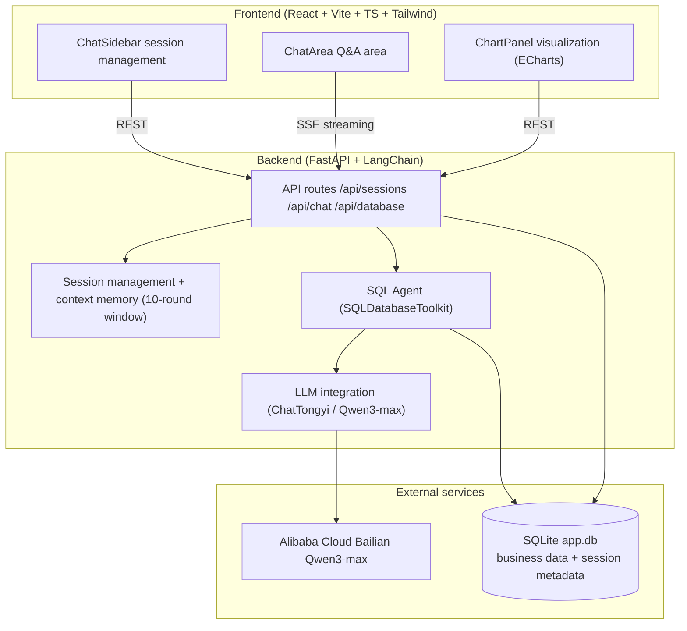

<div align="center">
  <strong>English</strong> · <a href="phased_plan_cn.md">中文</a>
</div>

# NL2SQLAgent Phased Implementation Plan

## Summary

Keep the confirmed overall design unchanged (FastAPI + LangChain SQLDatabaseToolkit Agent + Bailian Qwen3-max/ChatTongyi, read-only SQL, single SQLite `app.db`, SSE streaming, React + Tailwind + Zustand + ECharts three-pane layout), progressing through four phases as specified: base frameworks and tests → frontend UI → backend APIs → frontend-backend integration. Each phase has clear deliverables and acceptance criteria.

### System design diagram



### Core dependencies

**Backend `backend/requirements.txt`**

```
fastapi>=0.109.0
uvicorn[standard]>=0.27.0
pydantic>=2.0.0
pydantic-settings>=2.0.0
python-dotenv>=1.0.0
langchain>=0.1.0
langchain-community>=0.0.20
dashscope>=1.14.0
sqlalchemy>=2.0.0
sse-starlette>=1.6.0
httpx>=0.25.0
```

**Frontend `frontend/package.json` core dependencies**

```json
{
  "react": "^18.2.0",
  "react-dom": "^18.2.0",
  "zustand": "^4.5.0",
  "echarts": "^5.5.0",
  "echarts-for-react": "^3.0.2",
  "react-markdown": "^9.0.1",
  "lucide-react": "^0.312.0"
}
```

> Version ranges are minimum constraints; the installer resolves the latest compatible versions.

## Phase 1: Set Up Frontend/Backend Base Frameworks and Run Tests

- Repo restructure: create `backend/` (FastAPI app + `requirements.txt` + `.env.example`) and `frontend/` (Vite + React + TS + Tailwind scaffold); remove the root-level `pyproject.toml` and `src/` placeholder package.
- Backend skeleton: `main.py` (lifespan, CORS, `/health`), `config.py` (`.env` config), `db` module (initialize `app.db`: `sales`/`employees` Chinese seed data + `chat_sessions`/`chat_messages` metadata tables).
- Frontend skeleton: three-pane placeholder layout (ChatSidebar / ChatArea / ChartPanel shells), vite/tsconfig/tailwind config, dark theme styles.
- Tests: backend pytest smoke tests (`/health`, DB table creation and seed data, session store table creation); frontend `npm run build` passes.
- Acceptance: with `uvicorn app.main:app --reload --port 8000` running, `/health` returns ok; pytest all green; frontend build succeeds.
- Verification checklist:
  - Backend: `http://localhost:8000/health` returns 200 ok
  - Backend: pytest smoke tests all pass
  - Frontend: `http://localhost:5173` renders the three-pane placeholder UI
  - Frontend: `npm run build` succeeds
  - CORS: the frontend can call `/health` cross-origin without errors

## Phase 2: Develop the Frontend UI

- ChatSidebar: session list / create / delete / rename, auto-titled from the first question.
- ChatArea: message list (markdown rendering), SSE streaming text, SQL code block display, stop generation, input box.
- ChartPanel: chart/table view toggle, bar/line/pie switching, SQL display, backend connection status indicator.
- State & communication: zustand store (sessions/messages/charts/view mode), `api.ts` (REST + fetch + ReadableStream SSE client), `useSession` / `useChat` hooks.
- Tests: SSE event parsing, store logic (session/message/chart state), key component interactions (Vitest + Testing Library); use the `/chat/test` endpoint or a local mock to verify streaming before the backend is ready.
- Acceptance: `npm run dev` renders the full three-pane UI; unit tests pass.
- Directory structure & component list:
  ```
  frontend/
  ├── index.html
  ├── package.json
  ├── vite.config.ts
  ├── tsconfig.json
  ├── tailwind.config.js
  ├── postcss.config.js
  └── src/
      ├── main.tsx                 # React entry
      ├── App.tsx                  # three-pane layout + backend status indicator
      ├── index.css                # Tailwind styles
      ├── types/index.ts           # Session / Message / ChartConfig / SSE types
      ├── services/api.ts          # REST + SSE (fetch + ReadableStream) client
      ├── store/useAppStore.ts     # Zustand global state
      ├── hooks/
      │   ├── useSession.ts        # session load/create/delete/switch
      │   └── useChat.ts           # send message + SSE streaming handling
      └── components/
          ├── ChatSidebar/
          │   ├── index.tsx        # session management panel
          │   └── SessionItem.tsx  # session list item
          ├── ChatArea/
          │   ├── index.tsx        # chat area container
          │   ├── MessageList.tsx  # message list
          │   ├── MessageItem.tsx  # single message (Markdown rendering)
          │   └── ChatInput.tsx    # input box
          └── ChartPanel/
              ├── index.tsx        # chart panel container (chart/table toggle)
              ├── Chart.tsx        # ECharts chart
              └── DataTable.tsx    # data table
  ```
- Zustand state:
  ```ts
  interface AppState {
    sessions: Session[]
    currentSessionId: string | null
    messages: Message[]
    isStreaming: boolean
    chartConfig: ChartConfig | null
    tableData: TableData | null
    viewMode: 'chart' | 'table'
  }
  ```
  Corresponding actions: `createSession` / `selectSession` / `deleteSession` / `addMessage` / `updateLastMessage` / `setChartConfig` / `setTableData` / `setViewMode`, etc.

## Phase 3: Develop the Backend APIs

- LLM module: `ChatTongyi` with `qwen3-max`, API key validation (error if missing), streaming/non-streaming instances.
- Memory module: load the last 10 rounds (20 messages) of history per session and convert them to LangChain messages, with an in-memory cache.
- Agent module: `SQLDatabaseToolkit` (list_tables / schema / query_checker / query) agentic loop; the system prompt enforces read-only (forbids INSERT/UPDATE/DELETE/DROP); tool results parsed with `ast.literal_eval` (not `eval`); chart heuristic (GROUP BY with ≤6 rows → pie, otherwise bar; ORDER BY + LIMIT → bar; default bar).
- APIs: `/api/sessions` CRUD and message query, `/api/chat` SSE (thinking / text / sql / data / chart / error / done), `/api/database/schema | tables | tables/{name}`.
- Tests: session CRUD and persistence, memory window trimming, SSE event sequence (mock LLM returning fixed SQL, verify thinking → sql → data → chart → done), invalid SQL / empty result / tool error paths, read-only constraint verification.
- Acceptance: the full `/api/chat` flow passes with a mocked LLM; pytest all green.
- Directory structure:
  ```
  backend/
  ├── requirements.txt
  ├── .env.example            # DASHSCOPE_API_KEY / model name / CORS
  ├── data/app.db             # generated at runtime: sales + employees + chat_sessions + chat_messages
  ├── tests/                  # test_*.py (pytest)
  └── app/
      ├── main.py             # FastAPI entry: lifespan / CORS / route registration / /health
      ├── config.py           # configuration management (pydantic-settings)
      ├── api/
      │   ├── session.py      # /api/sessions CRUD and message query
      │   ├── chat.py         # /api/chat SSE streaming
      │   └── database.py     # /api/database/schema|tables
      ├── core/
      │   ├── llm.py          # ChatTongyi(qwen3-max) instance and system prompt
      │   ├── memory.py       # sliding-window memory (10 rounds)
      │   └── agent.py        # SQL Agent loop + chart heuristic
      ├── db/
      │   ├── connection.py   # SQLite initialization and seed data
      │   └── session_store.py# chat_sessions / chat_messages persistence
      └── schemas/
          ├── chat.py         # SSE events / ChartConfig / QueryResult
          └── session.py      # Session request/response models
  ```
- API endpoints:
  - `GET /health` — health check
  - `GET /api/sessions` — list sessions
  - `POST /api/sessions` — create session
  - `GET /api/sessions/{id}` — session detail (with messages)
  - `PUT /api/sessions/{id}` — update session title
  - `DELETE /api/sessions/{id}` — delete session
  - `GET /api/sessions/{id}/messages` — message list
  - `POST /api/chat` — chat (SSE streaming)
  - `GET /api/database/schema` — database schema
  - `GET /api/database/tables` — table list
- SSE event types:
  - `thinking` — AI reasoning progress (tool calls)
  - `text` — answer text
  - `sql` — generated SQL
  - `data` — query results (columns / rows / raw)
  - `chart` — chart configuration
  - `error` — error message
  - `done` — completion marker
- LLM configuration:
  - Provider: default `openai_compatible` (OpenCode Go subscription, OpenAI-compatible endpoint) via `ChatOpenAI` (langchain-openai); `tongyi` (`ChatTongyi` / langchain-community) kept as a legacy fallback
  - Model: default `deepseek-v4-flash` (verified on the OpenCode Go endpoint with the full tool-call loop, cost-efficient; `qwen3.7-max` also verified and available for stronger reasoning)
  - Auth: `LLM_API_KEY` written to `backend/.env` (also accepts `OPENCODE_CODEX_API_KEY` / `DASHSCOPE_API_KEY`); errors if missing
  - Endpoint: `LLM_BASE_URL=https://opencode.ai/zen/go/v1`
  - Parameters: `temperature=0.7`; agent tool calls use non-streaming invocations to get complete `tool_calls`
  - System prompt: `SQL_AGENT_SYSTEM_PROMPT` enforces read-only (forbids INSERT/UPDATE/DELETE/DROP); results limited to top 10
  - Memory: sliding window of 10 rounds (20 messages), rebuilt and cached from `chat_messages`
- Verified interface contract (2026-08-14, validated with live OpenCode Go calls):
  - Non-streaming return (AIMessage): `content` (str); `tool_calls` (list, each `id` / `name` / `args` / `type`, e.g. `{id: "call_...", name: "TopProducts", args: {"n": 3}}`); `response_metadata` (`model_name` / `finish_reason` (`stop` or `tool_calls`) / `id` / `token_usage{completion_tokens, prompt_tokens, total_tokens, completion_tokens_details.reasoning_tokens}`).
  - Streaming return (AIMessageChunk): `content` carries incremental text; OpenCode Go returned the full content in one chunk for qwen3.7-max in this test; the final chunk's `response_metadata` carries `finish_reason` and `token_usage`.
  - Tool-call round trip: `llm.bind_tools([...])` → first `AIMessage.tool_calls[0]`; put that AIMessage back into the message list and append `ToolMessage(content=<tool result>, tool_call_id=<that id>)`, then invoke again for the final answer; `finish_reason="tool_calls"` when tools are requested.
  - NL2SQL chain (validated end-to-end): `SQLDatabase.from_uri()` → `SQLDatabaseToolkit(db, llm)` → `get_tools()` (sql_db_list_tables / sql_db_schema / sql_db_query / sql_db_query_checker) → `create_agent(model, tools, system_prompt)` → `agent.stream_events({"messages":[...]}, version="v3")`; `tool_calls` event items expose `tool_name` / `input` / `output_deltas` / `output`. A live "top 5 products by total quantity sold" run completed in 4 steps with correct SQL and answer.
  - Verification scripts: `backend/scripts/test_qwen3.py` (connectivity / streaming / tool calling) and `backend/scripts/test_nl2sql.py` (NL2SQL correctness); the real key lives only in `backend/.env` (gitignored) and script output is auto-redacted.

## Phase 4: Frontend-Backend Integration

- Match CORS and the frontend API base URL (localhost:5173 ↔ localhost:8000); with a real `LLM_API_KEY`, run `test_qwen3` (connectivity), `test_nl2sql` (NL2SQL correctness), and `test_e2e` (full pipeline).
- Acceptance scenarios: ① asking "monthly sales totals" renders a chart on the right and allows switching chart types/table view; ② write statements are rejected by the prompt with an explanation; ③ switching sessions keeps history and context memory independent; ④ the frontend shows a friendly error when the model or backend is unavailable.
- Delivery: commit and push the code; update the README quick-start instructions (backend `.env` setup, frontend startup steps).
- Frontend API service layer:
  ```ts
  // frontend/src/services/api.ts
  export const api = {
    getSessions: () => fetch('/api/sessions').then(r => r.json()),
    createSession: (title?: string) =>
      fetch('/api/sessions', {
        method: 'POST',
        headers: { 'Content-Type': 'application/json' },
        body: JSON.stringify({ title }),
      }).then(r => r.json()),
    deleteSession: (id: string) =>
      fetch(`/api/sessions/${id}`, { method: 'DELETE' }),
    getMessages: (id: string) =>
      fetch(`/api/sessions/${id}/messages`).then(r => r.json()),
  }
  ```
- SSE client (`/api/chat` is POST + JSON, so use fetch + ReadableStream parsing instead of EventSource):
  ```ts
  // frontend/src/hooks/useChat.ts (simplified)
  const sendMessage = async (sessionId: string, message: string) => {
    const res = await fetch('/api/chat', {
      method: 'POST',
      headers: { 'Content-Type': 'application/json', Accept: 'text/event-stream' },
      body: JSON.stringify({ session_id: sessionId, message }),
    })
    const reader = res.body!.getReader()
    const decoder = new TextDecoder()
    let buffer = ''
    while (true) {
      const { done, value } = await reader.read()
      if (done) break
      buffer += decoder.decode(value, { stream: true })
      // Parse SSE frames: event: text/sql/data/chart/error/done
      // event 'text'  → appendText(e.data)
      // event 'chart' → setChartConfig(JSON.parse(e.data))
      // event 'done'  → finish and close the stream
    }
  }
  ```
- Verification checklist:
  - Create / switch / delete sessions
  - Send a message and display the streaming reply
  - Show the generated SQL
  - Render charts dynamically (switchable chart types / table view)
  - Multi-turn conversation memory (context stays independent across sessions)
- Tech stack summary:
  - LLM: Alibaba Cloud Bailian Qwen3 (`qwen3-max`, `langchain-community[tongyi]`)
  - Backend: FastAPI + LangChain + SQLite3
  - Frontend: React 18 + Vite + TypeScript
  - State: Zustand
  - UI: Tailwind CSS (icons via lucide-react)
  - Charts: ECharts

## Assumptions & Defaults

- Phase order strictly follows the user's specification (frameworks → frontend → backend → integration), matching the reference project's development phases.
- Backend tests use pytest (reference `test_*.py` style); frontend tests use Vitest, with a passing build as the fallback for uncovered interactions.
- Before Phase 3, the frontend uses the backend `/chat/test` endpoint or a local mock; switch to the real API after Phase 3.
- Integration requires a valid `DASHSCOPE_API_KEY` (written into `backend/.env`).
- The confirmed design continues: read-only SQL, single SQLite file, Tailwind UI, ChatTongyi integration, 10-round sliding window.

## Ticket Breakdown (for Linear project / tickets, 26 total)

**Phase 1 — Base frameworks and tests (5)**

- [Phase1] Backend scaffold: `backend/` directory structure, requirements.txt, .env.example, config.py configuration management
- [Phase1] FastAPI entry and health check: main.py (lifespan, CORS, /health)
- [Phase1] SQLite initialization: `app.db` tables (sales / employees seed data + chat_sessions / chat_messages)
- [Phase1] Frontend scaffold: Vite + React + TS + Tailwind initialization, three-pane placeholder layout, dark theme
- [Phase1] Verification: pytest smoke tests, `/health` returns 200, `npm run build` succeeds, CORS works

**Phase 2 — Frontend UI (7)**

- [Phase2] Three-pane layout skeleton: ChatSidebar + ChatArea + ChartPanel containers
- [Phase2] ChatSidebar: session list, create/delete/rename, auto-title from the first question
- [Phase2] ChatArea: message list, input box, Markdown rendering (MessageItem)
- [Phase2] ChartPanel: ECharts bar/line/pie charts, data table, chart/table toggle
- [Phase2] Zustand state management: sessions / messages / chartConfig / tableData / viewMode
- [Phase2] Service layer and SSE client: api.ts (REST) + fetch + ReadableStream streaming parser
- [Phase2] Frontend tests: SSE event parsing, store logic, component interactions (Vitest)

**Phase 3 — Backend APIs (8)**

- [Phase3] LLM integration: ChatTongyi with qwen3-max, DASHSCOPE_API_KEY validation, read-only system prompt
- [Phase3] Database module: SQLDatabase wrapper and schema introspection (reuse app.db from Phase 1)
- [Phase3] Session management API: /api/sessions CRUD, message query, persistent storage
- [Phase3] Context memory: SessionMemoryManager sliding window of 10 rounds (rebuilt from chat_messages + cache)
- [Phase3] LangChain SQL Agent: SQLDatabaseToolkit tools, agentic loop, ast.literal_eval result parsing
- [Phase3] Chart heuristic: GROUP BY ≤6 → pie / ORDER BY + LIMIT → bar, generate chart events
- [Phase3] Chat API: /api/chat SSE streaming (thinking / text / sql / data / chart / error / done)
- [Phase3] Backend tests: session persistence, memory window, SSE event sequence (mocked LLM), error paths, read-only constraints

**Phase 4 — Frontend-backend integration (6)**

- [Phase4] Frontend API service layer: wrap sessions / database endpoints
- [Phase4] SSE client integration: stream text/sql events, real-time text rendering
- [Phase4] Chart data binding: receive chart events, dynamic rendering, chart/table toggle
- [Phase4] Error handling and read-only constraints: error event display, backend disconnect notice, write-rejection verification
- [Phase4] End-to-end tests: test_qwen3 / test_nl2sql / test_e2e (real API key)
- [Phase4] Docs and release: README quick-start instructions, commit and push
